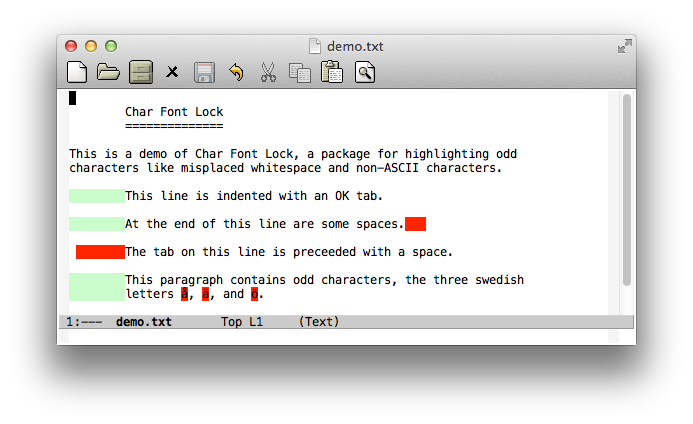

# char-font-lock - Highlight bad whitespace and out-of-place characters

*Author:* Anders Lindgren 
*Version:* 0.0.1 
*URL:* [https://github.com/Lindydancer/char-font-lock](https://github.com/Lindydancer/char-font-lock) 

*Char Font Lock* is an Emacs package that highlight bad whitespace
and out-of-place characters.

Char Font Lock is implemented as two minor modes:
`char-font-lock-mode`, which can be applied to an individual
buffer, and `char-font-lock-global-mode` which automatically
enables the mode in all existing and future buffers.

## What is highlighted

Currently, the following are highlighted:

* Correct tab characters are highlighted using a neutral color, to
  indicate that they are there
* Incorrect tabs, i.e. tabs not first on the line or any tab in
  case `indent-tabs-mode` isn't active
* Empty lines at the end of the buffer
* The last line, if it ends without a newline
* End of line whitespace. (Technically, this is not highlighted using
  a font-lock keyword, instead the built-in feature
  `show-trailing-whitespace` is used.)

## Installation

This package is designed to be installed as a "package". Once
installed, it is automatically activated.

## Customization

The following variables can be modified to fine-tune Char Font Lock:

* `char-font-lock-modes` -- For major modes that are members of
this list, or are derived from members in this list, Char Font Lock
Global mode will be enabled. As `prog-mode` and `text-mode`
initially are members, this mean that Char Font Lock is enabled for
most major modes, with the exception of special major modes like
`help-mode`. Some ancient third-party major modes are not derived
from the base modes provided by Emacs, in this case you can
explicitly add them to this list (alternatively, politely ask their
authors to take a step into the modern world).
* `char-font-lock-enabled-features-list` -- Control which highlight
rules should be applied to a major mode. For example, with the
default settings, end-of-file whitespace for
`lisp-interaction-mode` (used by the scratch buffer) is not
highlighted.

## Example

Below is a screenshot of a sample file, demonstrating the effect of
this package:

## Supported Emacs Versions

This package is primarily for Emacs 24.4. However, with the help of
the companion package [old-emacs-support][1] it can be used with
earlier Emacs versions, at least from Emacs 22.

[1]: https://github.com/Lindydancer/old-emacs-support

---
Converted from `char-font-lock.el` by [*el2markdown*](https://github.com/Lindydancer/el2markdown).
